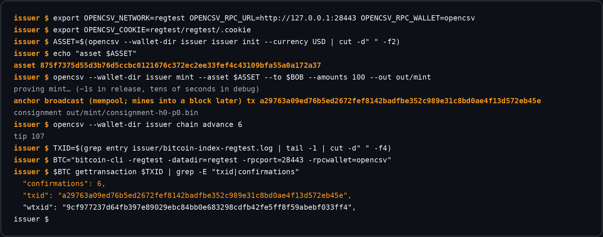

# The OpenCSV Journal

A chronological record of discoveries and how the architecture evolved.
Rendered on the site at [web/journal.html](../web/journal.html).

---

## 2026-07-31 — Inception: a client-side verified stablecoin on Bitcoin L1

The project starts from [Shielded CSV](https://eprint.iacr.org/2025/068)
(Nick–Eagen–Linus): client-side validation taken to its conclusion — the chain
carries only nullifiers, recipients verify proofs. Design decisions locked on
day one: anchor directly to Bitcoin L1 (no fork, no new chain), shielded
amounts with **public asset IDs and issuers** (auditable supply over shielded
transfers — the stablecoin-specific tension), and — unusually — **no zkVM**:
hand-written AIR over BabyBear with Plonky3-style recursion, "AIR or faster."

First artifacts: the [paper](../paper/opencsv.md) (v0.1) and the explainer site.

## 2026-07-31 — Recursive PCD works: constant-size proofs over arbitrary history

The core technical bet lands: the transfer circuit verifies **two predecessor
proofs in-circuit** (mint → transfer → transfer), giving constant proof size
and verification time regardless of coin history — the defining property of
proof-carrying data, demonstrated, not assumed. Later measured at 56,041 bytes
and ~3.6 ms verify per hop, identical at hop 1 and hop 2.
([BENCHMARKS.md](https://github.com/opencsvnet/opencsv-rs/blob/main/crates/opencsv-pcd/BENCHMARKS.md))

## 2026-07-31 — Formal verification from the start

Lean 4 mechanization of the protocol logic: inflation soundness (T1),
conservation (T2), nullifier uniqueness (T3), receiver correctness (T4) —
sorry-free, every hardness assumption a labeled axiom. Later: CI **axiom
gating**, so the assumption set can't grow silently
([run](https://github.com/opencsvnet/opencsv-formal/actions/runs/30674804692)).

## 2026-07-31 — Discovery: proving is single-thread-bound

Core-scaling benchmarks: 1 core ≈ 4 = 8 = 64 cores (~3 s per transfer). The
prover is effectively single-threaded at these circuit sizes — so single-core
speed is all that matters, which turns out to make phones interesting.

## 2026-08-01 — Phones beat the server 3–5×

On-device benchmarks (iPhone 16e / A18, iPhone 17 Pro Max / A19 Pro, via
[opencsv-rs#1](https://github.com/opencsvnet/opencsv-rs/issues/1)): recursive
transfer proving at **~0.55–0.96 s on-device** vs 2.97 s on the 64-core Xeon.
Mobile proving is viable — interactive UX territory. Proof sizes byte-identical
to the server, confirming the same circuits.

## 2026-08-01 — Payments over production Signal, both directions

The full loop on a physical iPhone: CLI mints → consignment as an E2E Signal
attachment → `+100 USD · verified` rendered natively in-app; the phone proves a
2-in/2-out transfer (~1 s) → CLI verifies. Audits agree on both sides.
([Signal-iOS#1](https://github.com/opencsvnet/Signal-iOS/issues/1),
[PR #2](https://github.com/opencsvnet/Signal-iOS/pull/2))

CLI-side captures (regenerated weekly by CI from real regtest runs):

## 2026-08-01 — **Discovery: copy-griefing** (the mempool attack)

A raw anchor record is just bytes. A mempool spy can copy a record into their
own transaction and front-run it — under a naive first-occurrence rule the copy
wins and the victim's coins freeze. **Burn, not theft**: the attacker gains
nothing, but the value is destroyed. This started a three-round redesign of the
anchor layer.

## 2026-08-01 — **Failure: the sidecar binding** (caught in code review)

First fix attempt: publish `(nf, B = H(nf, ctx))` and check well-formedness
publicly. Broken on arrival — both inputs are on-chain, so the griefer
*recomputes* B under their own context. The implementing agent flagged it
honestly rather than shipping it. The lesson that shaped the final design:
**public matchability and copy-forgeability are the same property.**

## 2026-08-01 — The bound-payload fix

The corrected construction: the on-chain payload IS the bound value,
`P = H("bind" ∥ nf ∥ ctx)`, and the raw nullifier never goes on-chain (it
travels in the consignment, already inside the proof's public data). Occurrence
recognition requires `nf`, so conflicts are visible to consignment holders.
Copying fails (wrong ctx); recomputing needs `nf` (preimage). Both directions
later mechanized in Lean (`griefer_copy_invisible`,
`no_occurrence_without_knowledge`).

## 2026-08-01 — Real Bitcoin: regtest e2e and a live signet anchor

The demo chain dies. A bitcoind-RPC backend runs the full flow with real
transactions on regtest (mint → VERIFIED → double-spend rejected at a real
block location → supply audit), and a 100-USD mint confirms on **Mutinynet
signet** (tx
[`3282c8ab…`](https://mutinynet.com/tx/3282c8abf1959f35827916ce56debc2d5ddbd52c2a8df33c53c4c724930495d1),
height 3308725), verified by a fresh wallet from server-scanned blocks. Two
backends (bitcoind RPC, esplora) converge on one ctx derivation after a near
dialect split.

## 2026-08-01 — **Discovery: BIP158 filters exclude OP_RETURN**

Empirical (verified against live bitcoind): basic compact block filters omit
OP_RETURN outputs entirely, so anchor records are never filter-matchable — the
compact-filter plan for point verification dies on contact. SPV (headers +
merkle + one block) takes over the point check. The exclusion scan is
*separately* impossible via filters because of the bound-payload duality above.

## 2026-08-01 — u64 limb soundness becomes a theorem

The u64 conservation gadget's carry argument — the scariest informal claim in
the codebase (a wrap-around bug there would mint money) — is mechanized
([b036cf3](https://github.com/opencsvnet/opencsv-formal/commit/b036cf3)):
field equality ⟺ integer equality within the checked range. Bonus honest
finding: the general converse is false (some valid splits are rejected at
witness generation — a completeness limitation, not a soundness hole),
documented instead of lurking. The living formal page now carries 17 theorems,
regenerated weekly from the build.

## 2026-08-01 — Indexing evolves four times in a day

Anchor-server (demoted) → owner's full node → N-of-M indexer cross-check →
finally **scan-first indexing**, the design that made filters useful again:
anchor transactions add a **constant marker output** (546 sats to
`OP_0 ∥ sha256(OP_TRUE)`, P2WSH, quantum-clean). Filters include it, so phones
find anchor blocks trustlessly at ~KB/block; the OP_RETURN record stays
ctx-bound and uncopiable; exclusion becomes a *local* check. Indexers demoted
to optional, spot-verifiable accelerators. Paper §4.7.1 rewritten the same day.

## 2026-08-01 — The scan soundness formal package

The formal layer follows the deployment: no-false-negatives of filter
discovery (trustless absence is *provable* — and it fell out of the
construction in one line), scan-exclusion soundness (scan-first ≡ full-block
scanning), marker zero-authority, and accelerator fraud-provability — 23
theorems, no new axioms
([00edaed](https://github.com/opencsvnet/opencsv-formal/commit/00edaed)). The
N-of-M honesty hypothesis is **eliminated from the roadmap** — the
architecture got better, so the assumptions got fewer.

## 2026-08-02 — Verify-then-adopt becomes real

The pure [`opencsv-kernel`](https://github.com/opencsvnet/opencsv-rs/commit/b64bdf49caa3a46a10084e20fc36560bb2b8def3)
carves binding, occurrence, first-occurrence, and supply logic into an
Aeneas-compatible Rust surface and dual-runs it against the legacy core.
The separate `formal-aeneas` project proves translated Rust equal to the Lean
specification. The important distinction is now enforceable: 29 specification
theorems and 15 translated-Rust audit declarations are separate honesty
ledgers, not one inflated theorem count.

## 2026-08-02 — The mempool sentinel: one symptom, three lookups

Fresh mints verified everywhere except the phone's credit path. Consignments
created before confirmation carried a mempool sentinel, while one snapshot
path demanded a confirmed location. Fixing only `locate()` would still fail:
the accept driver asks `anchor_at` and `ctx_at` first. Commit
[`1616397`](https://github.com/opencsvnet/opencsv-rs/commit/1616397)
resolves the sentinel through one shared lookup and makes chain lag a retryable
condition rather than a final rejection.

## 2026-08-02 — Serverless crediting closes the receive loop

[`opencsv_scan_export_snapshot`](https://github.com/opencsvnet/opencsv-rs/commit/290c8e0)
projects the phone's own compact-filter scan into the snapshot consumed by the
crediting verifier. A real consignment was verified and credited with **no RPC,
no indexer, and no anchor server**. This demoted public explorers to optional
hints and made the architectural rule explicit: an OpenCSV-specific server is
not part of acceptance.

## 2026-08-02 — A proof that only builds on one laptop is not a receipt

The first Aeneas project depended on an absolute local path and audited only a
subset of its declarations. The reproducibility branch pins the Aeneas Lean
library by exact Git revision, removes the duplicate binding theorem, expands
the translated-Rust audit to 15 declarations, and passes hosted Lean CI
([run 30765043746](https://github.com/opencsvnet/formal-aeneas/actions/runs/30765043746)).
The public formal page labels the 29 specification theorems and 15 refinement
declarations separately. The exact green commit was later fast-forwarded to
`formal-aeneas/main` as
[`3bcafed`](https://github.com/opencsvnet/formal-aeneas/commit/3bcafedf754dc473e648fcb6565f5ad9b80af963)
without a merge commit or history rewrite.

## 2026-08-02 — Field sync finds a consensus bug; batching v1 finds a script bug

The first signet sync failed at height 2016 because the client treated signet
like a min-difficulty test chain. Commit
[`e137096`](https://github.com/opencsvnet/opencsv-rs/commit/e137096)
syncs 315,800 headers through 156 retargets. Batching v1 then exposed a
standardness mistake: a bare `OP_TRUE` witness script fails CLEANSTACK when
envelope items remain. The corrected `OP_DROP×(n+1) OP_TRUE` construction
shipped as [`3d4da5f`](https://github.com/opencsvnet/opencsv-rs/commit/3d4da5f),
useful prototype evidence that was later superseded for new batch creation.

## 2026-08-02 — Batching becomes co-funded and signer-verifiable

The frozen v2 design removes coordinator-funded Bitcoin. A signed stock input
fixes the shared OpenCSV context; each participant contributes one payload,
one fee input, and one change output; every participant reconstructs the full
canonical transaction and releases only `SIGHASH_ALL`. C0/C1/C2 land as
[`d51d139`](https://github.com/opencsvnet/opencsv-rs/commit/d51d139),
[`0af0258`](https://github.com/opencsvnet/opencsv-rs/commit/0af0258), and
[`54c0833`](https://github.com/opencsvnet/opencsv-rs/commit/54c0833).
The current reference profile caps one batch at 64 participants for script
safety; that number is not a universal relay quota.

## 2026-08-02 — The project domain gets a real front door

The GitHub Pages project site originally kept its homepage under `web/` and
used a root meta-refresh. The `opencsv.net` cutover makes the repository root
the canonical homepage instead: assets remain grouped under `web/`, while the
old `web/index.html` becomes a compatibility redirect. The ordering is part of
the design, not deployment trivia: verify domain ownership and DNS before
changing the Pages custom domain, so the working `github.io` site never
redirects into an unresolved hostname.

## 2026-08-03 — Production proofs replace the beautiful prototype numbers

The ~56 KB / ~3.6 ms / ~0.55 s-phone profile did its job: it proved recursive
PCD and mobile feasibility. It used two FRI queries and no grinding, so it is
now labeled historical. D1 → D4 → D3 → D2 lands setup caching, in-circuit
predecessor-key binding, in-circuit issuer-seed authorization, and the frozen
v3 proof/profile boundary
([`ca8ad37`](https://github.com/opencsvnet/opencsv-rs/commit/ca8ad37),
[`97187e6`](https://github.com/opencsvnet/opencsv-rs/commit/97187e6),
[`8ee7a81`](https://github.com/opencsvnet/opencsv-rs/commit/8ee7a81),
[`d18c235`](https://github.com/opencsvnet/opencsv-rs/commit/d18c235)).

The new receipt is less cinematic and more useful: a 94-bit conservative
union-adjusted enforced floor, ~0.54–0.85 MB proofs, 15–22 ms desktop
verification, and 11.25–14.47 s transfer proving on the iPhone 16e. Two
higher-memory profiles were killed by iOS before the four-step Horner packing
made the deepest shape fit. Failed profiles belong in the receipt too.

## 2026-08-03 — A live child spends the marker and changes the protocol

The original marker was `P2WSH(sha256(OP_TRUE))`: filter-visible, but also
anyone-can-spend. On signet, a third party immediately spent its 546 sats and
pinned the parent against ordinary RBF. New anchors now use the unspendable
`P2WSH(sha256(OP_RETURN))` marker. Historical version-2 records remain readable
but cannot enter a new replacement epoch; new creation uses version 3. A
generic Bitcoin Core fee bump later removed protocol change, providing the
negative receipt for a pure replacement validator that permits only
context/layout-preserving change reduction. See the dated
[`SIGNET_READINESS.md`](https://github.com/opencsvnet/opencsv-rs/blob/main/SIGNET_READINESS.md).

## 2026-08-03 — Adversarial review attacks the batching fix itself

The first C1/C2 review found that Boolean “verified” flags, unauthenticated
relay bodies, and newest-epoch-only recovery were not security boundaries.
The remediation uses typed capabilities from authoritative chain verification,
stock/fee-key authorization over exact canonical bodies, semantic quotas,
durable `signature_released` state, and exact-manifest recovery across epochs
([`8d047f6`](https://github.com/opencsvnet/opencsv-rs/commit/8d047f6)).

The follow-up attack pass then found two more edges: historical v2 could still
enter a live C2 session, and a peer could slow-drip a frame by resetting socket
timeouts. The current review tip rejects v2 at every live/reopen boundary and
shares one absolute prefix+body deadline
([`e4265b9`](https://github.com/opencsvnet/opencsv-rs/commit/e4265b9)).
Two test-only corrections were added because the first receipt described cases
more precisely than its tests exercised. Receipt prose is a release invariant,
not decoration. Hosted CI and an independent re-review remain merge gates.

## 2026-08-03 — A Lean build can be green while the modeled rule is wrong

The first C3 batching-v2 model built and matched its axiom baseline, but review
found that `ConformingReplacement` never required either endpoint manifest to
be well formed. A formally “conforming” pair could therefore change the marker
or violate exact fee allocation and conservation. The model, not the receipt,
was repaired: both endpoints must now be valid, marker preservation is proved,
the 64-participant limit is explicitly a Rust/CLI reference policy rather than
a universal protocol constant, and proof-bearing signer readiness separates
verified public inputs from each signer's private reservation. Corrective
commit
[`a831b13`](https://github.com/opencsvnet/opencsv-formal/commit/a831b13bd80384cd14fc0aeaf38c126707a7c5d4)
closed that gap. Final comparison against frozen C1 then found missing
duplicate operation/payload/change-script rejection, reusable stock/change
floors, and nonzero proposal guards. Those are now explicit in the
assumption-free `manifest_c1_guards` receipt. Corrective
[`c4f970d`](https://github.com/opencsvnet/opencsv-formal/commit/c4f970da787b0d1a8a3057982c202f68f8dc6834)
passed exact hosted CI, expanded the checked audit to 54 declarations, and was
fast-forwarded to `opencsv-formal/main` through
[PR #2](https://github.com/opencsvnet/opencsv-formal/pull/2).

## 2026-08-03 — Signal owns the fee wallet; Bitcoin is gas only

The anchor-server architecture is superseded. Signal's target account owns a
Rust-managed OpenCSV wallet and a BIP84 Bitcoin fee wallet. Rust selects and
reserves fee UTXOs, derives change, fixes input zero before proof generation,
persists signed bytes before relay, and allows RBF only when the OpenCSV
context, record, marker, positions, and change destination remain intact.
Public Esplora data is an accelerator; confirmed spend state is rechecked
through headers, BIP158, merkle proofs, and full blocks. There is no WIF,
caller-selected UTXO/change, general BTC recipient, raw-transaction broadcast,
or bespoke OpenCSV server at the FFI boundary.

## 2026-08-03 — The phone restore that cloned a primary

iOS restored Keychain state onto the developer iPhone 16e. That meant an
account root alone could silently arm two primary devices against the same
coins and fee UTXOs. The Rust open boundary now requires a distinct 32-byte
binding from a non-migratable `ThisDeviceOnly` item, stores its root-bound
commitment in SQLite and the backup checkpoint, and opens missing/mismatched
restores read/export-only. Missing-binding state is sticky: supplying a newly
generated binding later still cannot re-arm the database
([`fb4a26a`](https://github.com/opencsvnet/opencsv-rs/commit/fb4a26a)).
Authority moves only through a future explicit recovery/rekey flow.

## 2026-08-03 — One consignment, one verdict, one bubble

Signal delivery attempts are not payment identities. Bincode accepts distinct
wire encodings of the same semantic consignment, so hashing attachment bytes
could duplicate a verdict even before retry nonces. The Rust receive boundary
now decodes, canonically re-encodes, verifies/stores the canonical bytes, and
returns one SHA-256 identity for both accepted and rejected verdicts
([`4dc05cf`](https://github.com/opencsvnet/opencsv-rs/commit/4dc05cf)).
Swift must key verdict and rendered-cell storage on that value. The physical
acceptance test still owes the proof: crash/resume into two attachment attempts,
exactly one verified payment bubble.

## 2026-08-03 — A merged Rust foundation is still not an iOS wallet

After exact hosted candidate CI succeeded, the owner deferred the outstanding
independent adversarial re-review and authorized strict fast-forwards:
integration `e4265b9`, then wallet `4dc05cf`, are now on `opencsv-rs/main`.
That review is deferred, not represented as completed; later findings must be
fixed forward. This merge changes the Rust foundation, not the product claim:
Signal-iOS source, the linked iPhone, releases, and mainnet remain untouched.
Swift still owes in-place migration, `ThisDeviceOnly` recovery, canonical
verdict/render storage, both build flags, and physical crash/retry/RBF evidence.

## 2026-08-04 — “USD” is a label, not a product definition

The first Signal mint UI asked for a ticker and amount. Entering `USD` could
therefore create an unrelated issuer asset without a named issuer, fixed
precision, backing statement, redemption terms, or recognizable identity.
Repeated attempts left several USD-looking assets and forced the sender to
choose among identifiers the product had never explained. The proof could be
valid while the wallet claim was meaningless.

The replacement preview supports one product: **OpenCSV USD Preview**, with
fixed Rust-owned terms, six decimals, and one exact `asset_id`. The production
FFI accepts no arbitrary definition; `opencsv_preview_usd_ensure(handle)` is
idempotent, signet/regtest-only, and freezes writes until the new checkpoint is
secured by Signal Backup. Signal accepts a human decimal amount and selects no
ticker, issuer, Bitcoin input, or asset identity. Old ticker-only and custom
assets remain readable prototypes but are excluded from issuance and send.

This is explicitly not Tether or USDT. A future Tether instrument must cross a
new authenticated issuer/terms/asset-version boundary; preview balances cannot
be silently renamed or converted.

The implementation is published as draft
[opencsv-rs PR #5](https://github.com/opencsvnet/opencsv-rs/pull/5) at
`3bfaa1876507a086feda15ba147f85d0ca3c4f4d` and draft
[Signal-iOS PR #4](https://github.com/opencsvnet/Signal-iOS/pull/4) at
`aa9fc33178`. The exact receipt is 4 core instrument tests, 26 Rust
account-wallet tests, an iOS 15 device/universal-simulator XCFramework build,
CocoaPods fetching and rebuilding that framework from the pushed Rust SHA, a
complete unsigned Signal simulator build with the app targets'
`-warnings-as-errors`, and the focused exact USD decimal parser/formatter test.
These are published-branch local integration receipts, not hosted CI approval,
a merge, release, mainnet activation, or physical-phone acceptance result. The
linked iPhone was deliberately untouched because its installed profiles require
an Apple Development certificate/private key that is not currently present in
the keychain.

---

*Screenshots are regenerated weekly by CI from real regtest runs
([workflow](https://github.com/opencsvnet/opencsv/actions/workflows/screenshots.yml)).
Benchmarks live in
[BENCHMARKS.md](https://github.com/opencsvnet/opencsv-rs/blob/main/crates/opencsv-pcd/BENCHMARKS.md).
The formal ledger is at [opencsvnet.github.io/opencsv/web/formal.html](../web/formal.html).*
